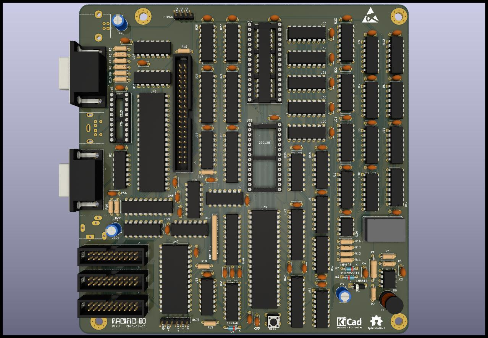

# Pacific-80

## Features

- CPU: Intel 8080A at 3.15 MHz
- RAM: 128 (or 240) Kbytes static
- ROM: 16 Kbytes
- Storage: CompactFlash (and/or SD card perhaps in the future)
- Video:
    - VGA output
    - Single graphics mode: 320x240, 4 colors per pixel, fixed palette
    - Transparent memory access without slowing down the CPU (the idea taken from "Специалист" ("Specialist", soviet-era home computer))
    - MB14241-like accelerator (is it worth it?) as a separate board
- Sound: 3 channels + noise with SN76489A
- Keyboard: PS/2 with AT90S2313
- Sega gamepad connector
- UART with i8251A
- Interrupts from keyboard, VBLANK, UART
- 3 extension slots
- OS: CP/M 2.2

## Характеристики

- процессор: КР580ВМ80А 3.15 МГц
- ОЗУ: 128 (240) КБ статика
- ПЗУ: 16 КБ
- хранилище: CompactFlash и/или возможно в будущем SD-карта
- видео:
    - выход на VGA монитор
    - 1 графический режим: 320x240, 4 цвета на точку, фиксированная палитра
    - прозрачный доступ к памяти без торможения процессора (идея позаимствована у «Специалиста»)
    - «видеоускоритель» — аналог MB14241 на отдельной плате
- звук: 3 канала + шум на микросхеме SN76489A
- клавиатура PS/2 на AT90S2313
- Sega геймпад
- UART на КР580ВВ51А
- прерывания от клавиатуры, VBLANK, UART
- 3 слота расширения
- ОС: CP/M 2.2

